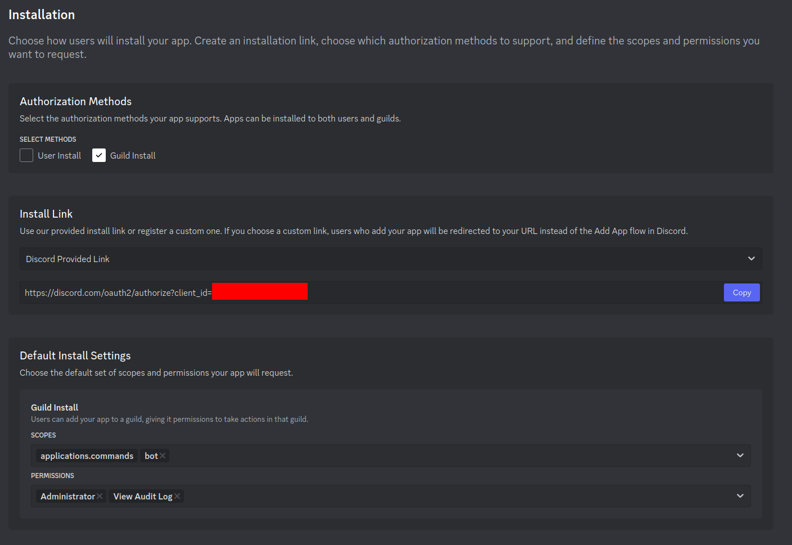

# Discord UnRaid Bot

This is a simple discord bot helps with server damage control after raids or rogue admin attacks.

Currently this bot can:
- List banned users in the server in a given time frame;
- List the last changed/deleted roles in a given time frame;
- Restore a role using the audit logs;

## Installation

1. Install dependencies:
```bash
pnpm i
```

2. Duplicate the `.env.example` file in the root directory and rename it to `.env`;

3. Create a new App in the [Discord Developer Portal](https://discord.com/developers/applications) and copy the access token:

4. Paste the token in the `.env` file;

5. Start the bot:
```bash
pnpm dev
```

6. Setup the Guild Install permissions (requires `Administrator` and `View Audit Log`) and then invite the bot to your server using the generated invite link:



## Usage

The bot's commands can only be used by `users` with the `Administrator` role in the server.
To change the amount of logs fetched (defaults to 100), edit the `AuditLogsLimit` constant in the `src/constants.ts`.

Commands:

- `/list-bans`: Lists the last 100 banned users in the server and saves the results to the `File System`; Accepts a 2 optional arguments:
    - `before`: only shows bans before the specified date (`YYYY-MM-DD` format);
    - `after`: only shows bans after the specified date (`YYYY-MM-DD` format);

- `/list-roles-changes`: Lists the last 100 changed/deleted roles in the server and saves the results to the `File System`; Accepts a 2 optional arguments:
    - `before`: only shows roles before the specified date (`YYYY-MM-DD` format);
    - `after`: only shows roles after the specified date (`YYYY-MM-DD` format);

- `/restore-role-from-log`: Restores a changed/deleted role using an `AuditLog`;  `Warning: This command may create duplicate roles if the role was already restored;`  Accepts 2 required and 2 optional arguments:
    - required:
        - `role-id`: the role's id, can be obtained from `/list-roles-changes` command;
        - `log-id`: the audit log's id, can be obtained from `/list-roles-changes` command;
    - optional:
        - `before`: only shows bans before the specified date (`YYYY-MM-DD` format);
        - `after`: only shows bans after the specified date (`YYYY-MM-DD` format);

- `/restore-role-from-log`: Extracts a changed/deleted role data using an `AuditLog` and saves the result to the `File System`;  Accepts 2 required and 2 optional arguments:
    - required:
        - `role-id`: the role's id, can be obtained from `/list-roles-changes` command;
        - `log-id`: the audit log's id, can be obtained from `/list-roles-changes` command;
    - optional:
        - `before`: only shows bans before the specified date (`YYYY-MM-DD` format);
        - `after`: only shows bans after the specified date (`YYYY-MM-DD` format);

